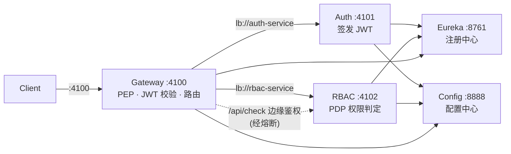
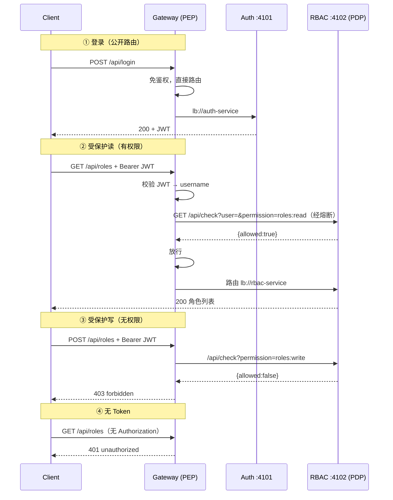

# 架构文档：Spring Cloud RBAC 微服务

> RBAC（基于角色的访问控制）微服务系统，基于 **Spring Boot 3.2.5 + Spring Cloud 2023.0.3（Java 17）**。
> 由 7 个服务组成：服务注册中心、配置中心、认证服务、授权服务、API 网关、CRM 客户域、审计服务。
> 网关同时承担 **PEP（策略执行点）**，对跨服务的 PDP（策略决策点）调用接入 **Resilience4j 熔断**。
> 关键架构决策与踩坑结论见 [docs/adr](./docs/adr/README.md)（ADR 编号索引）。

---

## 1. 概述

本系统的目标是演示一套「可落地」的微服务鉴权骨架：

- **单一入口**：外部只能打到 API 网关（4100），内部服务只注册在 Eureka，不直接暴露。
- **认证 / 授权分离**：`auth-service` 负责认证（签发 JWT），`rbac-service` 负责授权判定（PDP），网关做边缘鉴权（PEP）。
- **零三方安全库**：自实现 HS256 JWT 与 PBKDF2 密码哈希，避免引入 jjwt / spring-security 带来的版本冲突（见 §9 取舍）。
- **韧性**：网关对 PDP 的远程调用被熔断包裹，PDP 抖动或不可达时 **fail-closed**（拒绝而非放行）。

> ⚠️ 这是教学 / 演示级实现，`jwt-secret` 为明文 `dev-only-secret-change-me-please`，**禁止直接用于生产**。

---

## 2. 架构全景



### 服务清单

| 服务 | 端口 | 角色 | 关键依赖 |
|------|------|------|----------|
| `eureka-server` | 8761 | 服务注册与发现（`@EnableEurekaServer`） | `spring-cloud-starter-netflix-eureka-server` |
| `config-server` | 8888 | 集中配置（native 后端，classpath `config-repo`） | `spring-cloud-config-server` |
| `auth-service` | 4101 | 认证：用户登录、签发 JWT、密码哈希 | `spring-boot-starter-web` + Eureka/Config Client + H2 |
| `rbac-service` | 4102 | 授权：角色/权限/继承、`/api/check` PDP | `spring-boot-starter-web` + Eureka/Config Client + H2 |
| `gateway-service` | 4100 | API 网关：JWT 校验 + PEP + 路由转发 | `spring-cloud-starter-gateway` + LoadBalancer + **Resilience4j 2.2.0** |

> 父 `pom.xml` 通过 `spring-cloud-dependencies:2023.0.3` BOM 统一版本；所有服务 `groupId=com.example`，Java 17。

---

## 3. 服务职责

### 3.1 Eureka Server（8761）
- 纯注册中心，`register-with-eureka: false` / `fetch-registry: false`（自己不注册自己）。
- 关键加固：缩短服务端响应缓存，使新实例更快被消费者感知（见 §8）。

### 3.2 Config Server（8888）
- `spring.profiles.active: native`，配置来源 `classpath:/config-repo`。
- 按服务名分文件提供环境相关配置：`auth-service.yml` / `rbac-service.yml` / `gateway-service.yml`。
- 外置内容：`jwt-secret` / `jwt-ttl`（gateway 与 auth 共用，用于签发/校验 JWT）以及各服务数据源。**本地 `application.yml` 只留端口、服务名、`config.import`、Eureka 地址。** 这样密钥与连接串不散落在各服务代码里。
- 示例（`config-repo/gateway-service.yml`）：
  ```yaml
  app:
    jwt-secret: "dev-only-secret-change-me-please"
    jwt-ttl: 86400000
  ```

### 3.3 Auth Service（4101）
- 负责认证：`POST /api/login` 校验密码、签发 JWT；`POST /api/register` 注册用户（PBKDF2 哈希存库）。
- `GET /api/me` 返回当前登录用户信息（仅校验 JWT）。
- 使用 `JwtUtil`（自实现 HS256）签发令牌；`PasswordUtil` 用 `PBKDF2WithHmacSHA256` 哈希口令。

### 3.4 RBAC Service（4102，PDP）
- 持有鉴权数据：角色（`roles`，含 `parent_id` 支持继承）、权限（`permissions`）、角色-权限（`role_permissions`）、用户-角色（`user_roles`）。
- 核心决策接口：`GET /api/check?user=&permission=` → `{allowed: bool}`。
- `resolveEffectivePermissions(user)` 沿 `parent_id` 做 **BFS 递归聚合**，得到用户的有效权限集合（含继承来的父角色权限）。
- 受保护资源接口：`/api/roles`、`/api/permissions`、`/api/users`（实际判定仍由网关 PEP 触发 `/api/check`）。

### 3.5 Gateway Service（4100，PEP）
- 基于 **Spring Cloud Gateway（WebFlux / Netty 响应式）**。
- `AuthGlobalFilter`（`@Order(-1)`，`GlobalFilter`）实现：
  1. **认证**：校验 `Authorization: Bearer <jwt>`，失败返回 401。
  2. **授权（PEP）**：把「路径 + HTTP 方法」映射为所需权限（见 §4.3），对需要特定权限的路由，调用 `rbac-service /api/check` 判定；无权限返回 403。
  3. **转发**：判定通过后将请求交还 Gateway，由其按 `lb://` 路由到内部服务。
- 内部调用 `rbac-service` 经 `LoadBalanced WebClient`（`lb://rbac-service`），并被 **Resilience4j 熔断包裹**（见 §5）。

---

## 4. 鉴权模型

### 4.1 令牌：零依赖 HS256 JWT
- 不引入 jjwt。自实现 `JwtUtil`：用 JDK `Mac`(HmacSHA256) + `Base64` + `jackson` 生成/校验 `header.payload.signature`。
- `app.jwt-secret` 来自 Config Server；`app.jwt-ttl` 默认 86400000ms（1 天）。
- 网关与 auth 共用同一 secret，确保签发与校验一致。

### 4.2 口令哈希：PBKDF2
- `auth-service` 用 `PBKDF2WithHmacSHA256`（带随机盐、多次迭代）存储口令哈希，不存明文。

### 4.3 路径 → 权限映射（PEP 侧）
网关 `mapPermission(path, method)` 约定：

| 路径段 | GET | 其它方法 |
|--------|-----|----------|
| `/api/roles` | `roles:read` | `roles:write` |
| `/api/permissions` | `permissions:read` | `permissions:read` |
| `/api/users` | `users:read` | `users:write` |
| `/api/me`、`/api/check` | 仅需登录（null） | 仅需登录（null） |

> `/api/login`、`/api/register`、`/health`、`/actuator/**` 为公开路由，网关直接放行。

### 4.4 角色继承（PDP 侧）
- `roles.parent_id` 构成角色树；`rbac-service` 在 `resolveEffectivePermissions` 中 **BFS 向上聚合**父角色权限。
- 示例：`viewer → user → admin` 继承链下，`viewer` 自动拥有 `user` 的全部权限（如 `roles:read`、`users:read`），但不拥有 `roles:write`。这正是 demo 中 `alice`（被授 `viewer`）能「列角色 200 / 建角色 403」的原因。

### 4.5 PEP / PDP 分离
- **PDP = `rbac-service`**：只回答「该用户是否有某权限」，不关心请求来自哪条路由。
- **PEP = `gateway-service`**：负责把外部请求「翻译」成权限问题去问 PDP，并执行允许/拒绝。
- 内部服务之间不再各自做鉴权，鉴权边界收敛到网关这一道门。

---

## 5. 熔断设计（Resilience4j）

网关对 PDP 的调用是**跨进程网络调用**。PDP 变慢或错误率升高时，若每个请求都卡等，会拖垮网关与上游。因此用熔断器保护。

### 5.1 接入方式
- 依赖：`resilience4j-spring-boot3` + `resilience4j-reactor`（均 2.2.0）。
- 在 `AuthGlobalFilter` 构造函数注入 `CircuitBreakerRegistry`，取实例 `rbac-check`。
- WebFlux 下用 `CircuitBreakerOperator.of(pdpCircuitBreaker)` 包裹 PEP 的 `Mono`（而非命令式注解）。

### 5.2 配置（实例 `rbac-check`）

| 参数 | 值 | 含义 |
|------|-----|------|
| `slidingWindowType` | `COUNT_BASED` | 基于调用次数统计 |
| `slidingWindowSize` | `10` | 滑动窗口 10 次调用 |
| `minimumNumberOfCalls` | `5` | 至少 5 次才计算比率 |
| `failureRateThreshold` | `50` | 失败率 ≥ 50% 打开熔断 |
| `slowCallDurationThreshold` | `800ms` | 单次 > 800ms 视为慢调用 |
| `slowCallRateThreshold` | `50` | 慢调用率 ≥ 50% 打开熔断 |
| `permittedNumberOfCallsInHalfOpenState` | `3` | 半开态放行 3 次试探 |
| `waitDurationInOpenState` | `5s` | 打开后 5s 进入半开 |
| `automaticTransitionFromOpenToHalfOpenEnabled` | `true` | 开→半开自动切换 |

### 5.3 fail-closed 语义（关键）
PEP 调用被熔断包裹后，以下情况一律 **拒绝（403）**，绝不「放行绕过鉴权」：
- 熔断器处于 `OPEN`/`HALF_OPEN` 状态（`onErrorResume` 返回 `forbidden: pdp degraded (circuit <STATE>)`）；
- PDP 不可达 / 超时（`WebClient` 报错被 `onErrorResume` 捕获 → 403）。

即：**鉴权服务不可用时，安全取向是「拒绝对外」，而不是「放行」**——避免 PDP 挂掉导致全网越权。

### 5.4 观测
- `management.endpoints.web.exposure.include: health,circuitbreakers`。
- 查看实例状态：`GET /actuator/circuitbreakers/rbac-check` → `{"state":"CLOSED", ...}`。
- demo 实测：`state=CLOSED, bufferedCalls=5, failedCalls=0`（5 次 PEP 调用经熔断包裹健康计数）。

---

## 6. 网关请求流（时序）



---

## 7. 配置外置（Config Server）

- 各服务本地 `application.yml` 仅保留：`server.port`、`spring.application.name`、`spring.config.import`（指向 config-server）、`eureka.client.service-url`。
- 环境相关、易变、敏感的内容（JWT 密钥、数据源）放在 Config Server 的 `config-repo/<service-name>.yml`。
- 启动顺序要求：Config Server 必须先于依赖它的业务服务就绪（见 §11 Makefile）。

---

## 8. 服务发现与注册（Eureka）加固

本系统在「网关先启动、业务服务后注册」的时序下，遇到过 **503：`No servers available for service`**。根因是 Eureka 的注册表传播延迟：

- Eureka **服务端**默认 30s 响应缓存（`response-cache-update-interval-ms`）→ 消费者即使频繁拉取也拿不到「刚注册」的实例。
- 网关 **客户端**默认 30s 拉取间隔（`registry-fetch-interval-seconds`）→ 新实例进入负载均衡器更慢。

加固（已落地）：
| 位置 | 配置 | 值 |
|------|------|-----|
| `eureka-server` | `eureka.server.response-cache-update-interval-ms` | `3000` |
| `eureka-server` | `eureka.server.response-cache-auto-expiration-in-seconds` | `60` |
| `gateway-service` | `eureka.client.registry-fetch-interval-seconds` | `3` |
| 各业务服务 + 网关 | `eureka.instance.prefer-ip-address` / `ip-address` | `true` / `127.0.0.1` |

> **环回注册**：裸跑场景下，三业务服务与网关都用 `prefer-ip-address: true` + `ip-address: 127.0.0.1`，确保网关经 `lb://` 连接 `127.0.0.1` 必定可达，规避主机名 / LAN IP 不可达的隐患。容器化部署（Docker / k3s）下 `prefer-ip-address=true` 注册的是**容器 / Pod 真实 IP**（而非 `127.0.0.1`），网关在 K8s / compose 网络内直连该 IP，详见 §14。

---

## 9. 路由配置与踩坑

### 9.1 多 `Path` 谓词的 AND 陷阱（致命）
Spring Cloud Gateway **同一路由下的多个谓词是 AND 关系**。曾写成：

```yaml
# ❌ 错误：Path=/api/login AND Path=/api/register 永远不成立 → 路由匹配不上 → 404
- id: auth-public
  uri: lb://auth-service
  predicates:
    - Path=/api/login
    - Path=/api/register
```

正确写法——**单个 `Path` 谓词 + 逗号分隔多模式（OR 语义）**：

```yaml
# ✅ 正确
- id: auth-public
  uri: lb://auth-service
  predicates:
    - Path=/api/login,/api/register
```

`rbac-api` 同理合并为 `Path=/api/check,/api/roles/**,/api/permissions/**,/api/users/**`。

### 9.2 为何不用 spring-security / jjwt
- 引入 `spring-security` 会与 Spring Boot 3.2 自带的 `jackson` / `spring-core` 等传递版本产生冲突；
- `jjwt` 在 WebFlux 响应式上下文里增加了不必要的依赖面。
- 鉴权逻辑本身并不复杂（JWT 校验 + 权限映射 + 一次远程 `/api/check`），自实现 `JwtUtil` / `PasswordUtil` 反而更可控、依赖面最小。

---

## 10. 数据模型（各服务独立 H2 文件库）

`auth-service`（用户）：

| 表 | 字段要点 |
|----|----------|
| `users` | `id`, `username`, `password_hash`（PBKDF2）, `salt` |

`rbac-service`（权限）：

| 表 | 字段要点 |
|----|----------|
| `roles` | `id`, `name`, `parent_id`（角色继承） |
| `permissions` | `id`, `name`（如 `roles:read`） |
| `role_permissions` | `role_id`, `permission_id` |
| `user_roles` | `user_id`, `role_id` |

> 种子：`admin/admin123`；角色 `admin → user → viewer`；权限 `roles:read/write`、`permissions:read`、`users:read/write`；`admin` 用户关联 `admin` 角色。

---

## 11. 部署与运行（Makefile）

`Makefile` 收口常用动作：`help` / `build` / `start` / `stop` / `restart` / `status` / `demo` / `reset-db` / `clean`，以及容器化的 `docker-*` / `k3s-*` 动作（见 §14 与 `DOCKER.md`）。

- **启动顺序**：`eureka-server` → `config-server` → `auth-service` / `rbac-service` → `gateway-service`。
- **端口保护**：启动用 `env -u SERVER__PORT -u SERVER_PORT`（沙箱可能注入 `SERVER__PORT` 覆盖 `server.port`）。
- **就绪等待**：各服务 JVM `-Xmx256m` 控内存；业务就绪后 `sleep 35`，给 Eureka 注册表传播 + 网关 lb 缓存刷新留足余量（配合 §8 加固）。
- **代理绕过**：脚本内 `curl` 一律 `--noproxy 127.0.0.1,localhost`（避免 HTTP 代理拦截 localhost）。
- **演示**：`make demo`（`scripts/demo.sh`）走网关跑完整链路：登录 admin → 建角色 → 注册 alice → 授 viewer → 验证 alice 列角色 200 / 建角色 403。

快速开始：

```bash
cd work/research/spring-rbac
make build      # 在线构建 5 个 jar（首次需联网补齐传递依赖）
make start      # 启动并等待就绪
make demo       # 经网关端到端验证
make stop       # 停止
make reset-db   # 重置 H2 数据（demo 非幂等，重跑前需 reset）
```

---

## 12. 设计取舍小结

| 决策 | 选择 | 理由 |
|------|------|------|
| 网关 | Spring Cloud Gateway（WebFlux） | 原生服务发现 + 响应式过滤链，适合做 PEP |
| 安全库 | 自实现 JwtUtil / PasswordUtil | 避免 spring-security / jjwt 版本冲突，依赖面最小 |
| 熔断 | Resilience4j（reactor operator） | 与 WebFlux 天然契合；fail-closed 保证安全取向 |
| 注册中心 | Eureka | 与 Spring Cloud 生态开箱即用；配合缓存/拉取加固 |
| 配置 | Config Server native | 密钥/数据源外置，本地 yml 极简 |
| 数据库 | 每服务独立 H2 文件库 | 演示零外部依赖；生产可换 PG/MySQL |

---

## 13. 安全与后续

- **当前为演示级**：JWT 密钥明文、`dev-only`；无 HTTPS、无刷新令牌、无限流、无审计日志。
- **生产化建议**：密钥进 KMS / 环境变量；网关前加 TLS 终止；PDP 调用加超时与重试预算；补充审计与限流；考虑 OAuth2 资源服务器模式替代自实现 JWT。
- **熔断调参**：`rbac-check` 的窗口/阈值按真实 PDP 延迟分布调整；可配合 `TimeLimiter` 给 WebClient 显式超时。

---

## 14. 容器化部署（Docker / k3s）

同一套代码**无需改动 `application.yml`**，仅靠运行时注入即可容器化运行（完整步骤与排错见 `DOCKER.md`）。几个决定性的运行时设计决定：

- **地址注入用 `JAVA_TOOL_OPTIONS` 而非扁平 env**：Eureka 的 `eureka.client.serviceUrl` 是 **Map 类型**、`spring.config.import` 是 **bootstrap 期属性**，扁平环境变量（`EUREKA_CLIENT_SERVICEURL_DEFAULTZONE` / `SPRING_CONFIG_IMPORT` 等）无法可靠绑定 → client 回退连 `localhost`、注册全失败（详见 `DOCKER.md` 末尾「排错」）。改用 JVM 系统属性 `-D...` 经 `JAVA_TOOL_OPTIONS` 注入（优先级最高，Docker Compose 与 k8s 通用）。
- **实例注册用 `prefer-ip-address=true`**：容器 / Pod 以真实 IP 注册（裸跑为 `127.0.0.1`），网关 `lb://` 直连该 IP，避开主机名 / LAN IP 解析不稳定导致的 503（见 §8）。
- **启动顺序靠 initContainer（k8s）**：k8s 无 `depends_on`，auth/rbac/gateway 用 `busybox + nc` 的 initContainer 等 `config-server:8888`（网关额外等 `auth-service:4101` 与 `rbac-service:4102`）就绪再启动；Docker Compose 用 `depends_on: condition: service_healthy`。
- **`imagePullPolicy: IfNotPresent`**：OrbStack 下单节点 k3s 可直接看到 `docker build` 的本地镜像，有即直接用、不拉取，避开 `Never` 偶发无法解析本地镜像的坑。
- **资源限制**：各容器设 `resources`（主容器内存 `256Mi`/`384Mi`、CPU `100m`/`500m`；init 容器更小），避免单 Pod 吃满节点，也满足 kube-score 等静态检查对 CPU limit 的要求。

`Makefile` 提供容器化动作：`docker-build` / `docker-up` / `docker-start` / `docker-demo`、`k3s-build` / `k3s-deploy` / `k3s-status` / `k3s-demo` / `k3s-down` 等，与裸跑并存、互不干扰。
